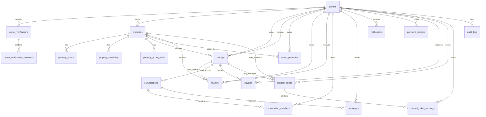

# DAR App - DATABASE_SCHEMA.md

> Official relational database specification for DAR. This document defines the Phase 2 relational model for the future Supabase/PostgreSQL backend without introducing SQL, migrations, RLS, or implementation code.

---

# 1. System Overview

DAR should use a single PostgreSQL database as the transactional source of truth for:

- identity and user profiles
- owner onboarding and trust verification
- property supply and marketplace publication
- booking and payment-verification flows
- traveler-owner messaging
- notifications
- reviews
- owner payouts
- support tickets
- staff auditability

The system is intentionally divided into bounded contexts:

- Identity: `profiles`
- Verification: `owner_verifications`, `owner_verification_documents`
- Listings: `properties`, `property_photos`, `property_availability`, `property_pricing_rules`
- Reservations: `bookings`, `saved_properties`, `reviews`
- Messaging: `conversations`, `conversation_members`, `messages`
- Notifications: `notifications`
- Payments and finance: `payment_methods`, `payouts`
- Support: `support_tickets`, `support_ticket_messages`
- Auditability: `audit_logs`

Two deliberate compatibility decisions define the initial foundation:

- The schema preserves `profiles.account_type` because the current code already reads and writes that column.
- Support messaging remains separate from traveler-owner messaging. The initial schema does not unify support threads into `conversations`; support uses `support_tickets` and `support_ticket_messages` only.

Two deliberate control decisions define public listing visibility:

- moderation and publication are modeled separately
- anonymous marketplace visibility depends on both approval and publication

Public marketplace visibility rule:

- a property is visible to anonymous users only when `moderation_status = approved`, `publication_status = published`, and `deleted_at is null`

---

# 2. Design Principles

## Normalization level

The schema should target third normal form for core transactional data.

- one fact belongs in one place
- repeatable collections become child tables
- business state is modeled through enums and timestamps, not scattered booleans
- denormalization is deferred to reporting, search, or caching layers

Intentional exceptions:

- immutable booking and payout amounts are stored directly on those rows because they represent historical financial facts
- future analytics/search projections may duplicate data outside the transactional core

## UUID strategy

All business entities use UUID primary keys.

- primary keys are opaque and non-sequential
- all foreign keys use UUID
- human-readable references such as booking numbers and ticket references are separate unique business identifiers

## Timestamps

Every mutable table should include:

- `created_at timestamptz not null default now()`
- `updated_at timestamptz not null default now()`

Lifecycle-specific timestamps are added where needed:

- `submitted_at`
- `approved_at`
- `rejected_at`
- `published_at`
- `confirmed_at`
- `cancelled_at`
- `resolved_at`
- `deleted_at`

All timestamps should be stored in UTC.

## Soft delete strategy

Soft deletion is the default for user-owned, customer-facing, or compliance-relevant entities.

- use nullable `deleted_at`
- prefer retention over destructive deletion
- use hard deletion only for operational rows that are safe to regenerate or are not meaningful historical records

Recommended soft-delete entities:

- `profiles`
- `owner_verifications`
- `owner_verification_documents`
- `properties`
- `property_photos`
- `messages`
- `notifications`
- `payment_methods`
- `support_tickets`

## Ownership model

Ownership should always be explicit through foreign keys to `profiles`.

- traveler-owned data uses `traveler_id` or `user_id` depending on the bounded context
- owner-owned data uses `owner_id` or `owner_profile_id` depending on the bounded context
- staff-attributed actions use `reviewed_by_profile_id`, `assigned_to_profile_id`, `actor_profile_id`, or similar
- shared entities like conversations use membership tables

## Naming conventions

- table names: plural snake_case
- columns: snake_case
- primary keys: `id`
- foreign keys: `<entity>_id`
- enum values: snake_case
- timestamps: `<event>_at`
- monetary values: integer minor units with `_amount`
- booleans: `is_*` or `has_*`
- references: `<entity>_reference`

## Current compatibility rule

The initial database foundation must remain compatible with the existing codebase.

- keep `profiles.account_type`
- do not introduce `profile_roles` in Phase 2
- treat account identity as a single primary account type for now

Current recommendation:

- `account_type` remains a single-role column
- allowed values may expand beyond `guest` and `owner`, but the model itself remains single-role until product requirements explicitly require multi-role accounts

---

# 3. Entity Relationship Diagram

---

# 4. Database Tables

## 4.1 `profiles`

**Purpose**

Application-level user profile linked to Supabase Auth identity and used by all business entities.

**Columns**

| Column | Data type | Nullable | Default |
|---|---|---:|---|
| `id` | `uuid` | No | none; matches `auth.users.id` |
| `account_type` | `account_type` enum | No | `guest` |
| `full_name` | `text` | No | none |
| `display_name` | `text` | Yes | `null` |
| `email` | `citext` | No | none |
| `phone` | `text` | Yes | `null` |
| `avatar_url` | `text` | Yes | `null` |
| `country_code` | `text` | Yes | `null` |
| `country_name` | `text` | Yes | `null` |
| `dialing_code` | `text` | Yes | `null` |
| `date_of_birth` | `date` | Yes | `null` |
| `nationality` | `text` | Yes | `null` |
| `preferred_language` | `text` | Yes | `null` |
| `preferred_currency` | `text` | Yes | `null` |
| `city` | `text` | Yes | `null` |
| `country` | `text` | Yes | `null` |
| `address` | `text` | Yes | `null` |
| `address_line_1` | `text` | Yes | `null` |
| `address_line_2` | `text` | Yes | `null` |
| `profile_completion` | `integer` | No | `0` |
| `email_verified` | `boolean` | No | `false` |
| `email_verified_at` | `timestamptz` | Yes | `null` |
| `phone_verified` | `boolean` | No | `false` |
| `phone_verified_at` | `timestamptz` | Yes | `null` |
| `identity_verified` | `boolean` | No | `false` |
| `emergency_contact_name` | `text` | Yes | `null` |
| `emergency_contact_phone` | `text` | Yes | `null` |
| `is_active` | `boolean` | No | `true` |
| `deactivated_at` | `timestamptz` | Yes | `null` |
| `deleted_at` | `timestamptz` | Yes | `null` |
| `created_at` | `timestamptz` | No | `now()` |
| `updated_at` | `timestamptz` | No | `now()` |

**Indexes**

- primary key on `id`
- unique index on `email`
- index on `account_type`
- partial index on `deleted_at is null`
- partial index on `(account_type, is_active)` where `deleted_at is null`

**Unique constraints**

- `email`

**Foreign keys**

- `id -> auth.users.id`

**Deletion behavior**

- recommended FK behavior: `on delete restrict`
- normal user removal should be handled as deactivation or soft deletion, not auth-row deletion
- destructive deletion should require a separate anonymization/retention workflow

**Relationships**

- one-to-many with most business entities

**Business rules**

- exactly one profile per auth user
- `account_type` is the initial compatibility-safe account classification column
- current schema assumes one primary account type per profile, not multi-role membership
- `address`, `profile_completion`, `email_verified`, `phone_verified`, `identity_verified`, `emergency_contact_name`, and `emergency_contact_phone` are intentional compatibility columns required by the current traveler/auth application contract
- `address` is transitional alongside normalized address fields
- `profile_completion` and the verification booleans are compatibility-safe canonical columns for the current app contract

## 4.2 `owner_verifications`

**Purpose**

Owner identity or business verification submissions and review outcomes.

**Columns**

| Column | Data type | Nullable | Default |
|---|---|---:|---|
| `id` | `uuid` | No | generated |
| `owner_id` | `uuid` | No | none |
| `verification_type` | `owner_verification_type` enum | No | none |
| `status` | `verification_status` enum | No | `not_started` |
| `legal_full_name` | `text` | Yes | `null` |
| `business_name` | `text` | Yes | `null` |
| `business_registration_number` | `text` | Yes | `null` |
| `tax_identifier` | `text` | Yes | `null` |
| `date_of_birth` | `date` | Yes | `null` |
| `review_notes` | `text` | Yes | `null` |
| `rejection_reason_code` | `verification_rejection_reason` enum | Yes | `null` |
| `submitted_at` | `timestamptz` | Yes | `null` |
| `under_review_at` | `timestamptz` | Yes | `null` |
| `approved_at` | `timestamptz` | Yes | `null` |
| `rejected_at` | `timestamptz` | Yes | `null` |
| `reviewed_by_profile_id` | `uuid` | Yes | `null` |
| `deleted_at` | `timestamptz` | Yes | `null` |
| `created_at` | `timestamptz` | No | `now()` |
| `updated_at` | `timestamptz` | No | `now()` |

**Indexes**

- primary key on `id`
- index on `owner_profile_id`
- index on `status`
- composite index on `(owner_profile_id, status, created_at desc)`

**Unique constraints**

- no global unique constraint
- recommended business rule: one active non-final verification per owner at a time

**Foreign keys**

- `owner_profile_id -> profiles.id`
- `reviewed_by_profile_id -> profiles.id`

**Deletion behavior**

- `owner_profile_id on delete restrict`
- `reviewed_by_profile_id on delete set null`
- soft delete allowed through `deleted_at`

**Relationships**

- many verification attempts per owner over time
- one verification to many verification documents

**Business rules**

- preserves submission history instead of overwriting one row forever

## 4.3 `owner_verification_documents`

**Purpose**

Metadata for private verification files stored in Supabase Storage or equivalent object storage.

**Columns**

| Column | Data type | Nullable | Default |
|---|---|---:|---|
| `id` | `uuid` | No | generated |
| `owner_verification_id` | `uuid` | No | none |
| `document_type` | `verification_document_type` enum | No | none |
| `storage_path` | `text` | No | none |
| `original_file_name` | `text` | No | none |
| `mime_type` | `text` | No | none |
| `file_size_bytes` | `bigint` | No | none |
| `review_status` | `document_review_status` enum | No | `pending` |
| `rejection_reason` | `text` | Yes | `null` |
| `uploaded_by_profile_id` | `uuid` | No | none |
| `deleted_at` | `timestamptz` | Yes | `null` |
| `created_at` | `timestamptz` | No | `now()` |
| `updated_at` | `timestamptz` | No | `now()` |

**Indexes**

- primary key on `id`
- index on `owner_verification_id`
- composite index on `(owner_verification_id, document_type, created_at desc)`
- partial unique index on `(owner_verification_id, document_type)` where `deleted_at is null`
- index on `review_status`

**Unique constraints**

- one active document row per verification and document type

**Foreign keys**

- `owner_verification_id -> owner_verifications.id`
- `uploaded_by_profile_id -> profiles.id`

**Deletion behavior**

- `owner_verification_id on delete cascade`
- `uploaded_by_profile_id on delete restrict`
- soft delete preferred

**Relationships**

- child metadata rows under `owner_verifications`

**Business rules**

- raw document contents never live in PostgreSQL
- `storage_path` points to a private object store path
- security expectation: access must be limited to owning user and authorized staff

## 4.4 `properties`

**Purpose**

Canonical listing record for all rentable inventory.

**Columns**

| Column | Data type | Nullable | Default |
|---|---|---:|---|
| `id` | `uuid` | No | generated |
| `owner_profile_id` | `uuid` | No | none |
| `public_slug` | `text` | No | none |
| `property_type` | `property_type` enum | No | none |
| `moderation_status` | `property_moderation_status` enum | No | `draft` |
| `publication_status` | `property_publication_status` enum | No | `unpublished` |
| `title` | `text` | No | none |
| `description` | `text` | Yes | `null` |
| `country_code` | `text` | No | `EG` |
| `country_name` | `text` | No | `Egypt` |
| `city` | `text` | No | none |
| `area` | `text` | Yes | `null` |
| `address_line_1` | `text` | No | none |
| `address_line_2` | `text` | Yes | `null` |
| `building_name` | `text` | Yes | `null` |
| `latitude` | `numeric(9,6)` | Yes | `null` |
| `longitude` | `numeric(9,6)` | Yes | `null` |
| `location_precision` | `location_precision` enum | No | `approximate` |
| `max_guests` | `integer` | No | none |
| `bedrooms_count` | `integer` | No | `0` |
| `beds_count` | `integer` | No | `0` |
| `bathrooms_count` | `integer` | No | `0` |
| `area_size_sqm` | `integer` | Yes | `null` |
| `base_nightly_amount` | `integer` | No | none |
| `cleaning_fee_amount` | `integer` | No | `0` |
| `security_deposit_amount` | `integer` | No | `0` |
| `currency_code` | `text` | No | `EGP` |
| `minimum_nights` | `integer` | No | `1` |
| `maximum_nights` | `integer` | Yes | `null` |
| `instant_book_enabled` | `boolean` | No | `false` |
| `submitted_for_review_at` | `timestamptz` | Yes | `null` |
| `approved_at` | `timestamptz` | Yes | `null` |
| `rejected_at` | `timestamptz` | Yes | `null` |
| `published_at` | `timestamptz` | Yes | `null` |
| `unpublished_at` | `timestamptz` | Yes | `null` |
| `suspended_at` | `timestamptz` | Yes | `null` |
| `archived_at` | `timestamptz` | Yes | `null` |
| `deleted_at` | `timestamptz` | Yes | `null` |
| `created_at` | `timestamptz` | No | `now()` |
| `updated_at` | `timestamptz` | No | `now()` |

**Indexes**

- primary key on `id`
- unique index on `public_slug`
- index on `owner_profile_id`
- composite index on `(moderation_status, publication_status, city, property_type)`
- composite index on `(owner_profile_id, moderation_status, publication_status, updated_at desc)`

**Unique constraints**

- `public_slug`

**Foreign keys**

- `owner_profile_id -> profiles.id`

**Deletion behavior**

- `owner_profile_id on delete restrict`
- soft delete preferred

**Relationships**

- one-to-many with photos, availability, pricing rules, bookings, reviews, saved properties, and support tickets

**Business rules**

- owners control listing content and may request publication changes
- admins control moderation outcomes and suspension
- anonymous marketplace visibility depends on `moderation_status = approved` and `publication_status = published`

## 4.5 `property_photos`

**Purpose**

Ordered property gallery metadata for stored listing images.

**Columns**

| Column | Data type | Nullable | Default |
|---|---|---:|---|
| `id` | `uuid` | No | generated |
| `property_id` | `uuid` | No | none |
| `storage_path` | `text` | No | none |
| `caption` | `text` | Yes | `null` |
| `photo_category` | `property_photo_category` enum | No | `other` |
| `sort_order` | `integer` | No | none |
| `is_cover` | `boolean` | No | `false` |
| `width_px` | `integer` | Yes | `null` |
| `height_px` | `integer` | Yes | `null` |
| `deleted_at` | `timestamptz` | Yes | `null` |
| `created_at` | `timestamptz` | No | `now()` |
| `updated_at` | `timestamptz` | No | `now()` |

**Indexes**

- primary key on `id`
- index on `property_id`
- unique index on `(property_id, sort_order)` where `deleted_at is null`
- partial unique index on `(property_id)` where `is_cover = true and deleted_at is null`

**Unique constraints**

- one active row per property and sort order
- one active cover photo per property

**Foreign keys**

- `property_id -> properties.id`

**Deletion behavior**

- `property_id on delete cascade`

**Relationships**

- many photos per property

**Business rules**

- sort order must remain stable for gallery rendering

## 4.6 `property_availability`

**Purpose**

Per-night inventory availability for each property.

**Columns**

| Column | Data type | Nullable | Default |
|---|---|---:|---|
| `id` | `uuid` | No | generated |
| `property_id` | `uuid` | No | none |
| `availability_date` | `date` | No | none |
| `status` | `availability_status` enum | No | `available` |
| `reason` | `availability_reason` enum | Yes | `null` |
| `booking_id` | `uuid` | Yes | `null` |
| `note` | `text` | Yes | `null` |
| `created_at` | `timestamptz` | No | `now()` |
| `updated_at` | `timestamptz` | No | `now()` |

**Indexes**

- primary key on `id`
- unique index on `(property_id, availability_date)`
- composite index on `(property_id, availability_date, status)`
- composite index on `(booking_id, availability_date)`

**Unique constraints**

- one row per property per date

**Foreign keys**

- `property_id -> properties.id`
- `booking_id -> bookings.id`

**Deletion behavior**

- `property_id on delete cascade`
- `booking_id on delete set null`

**Relationships**

- many availability rows per property

**Business rules**

- booked rows should reference a booking
- one row per night avoids ambiguity in overlaps

## 4.7 `property_pricing_rules`

**Purpose**

Date-range and calendar pricing overrides layered on top of base property pricing.

**Columns**

| Column | Data type | Nullable | Default |
|---|---|---:|---|
| `id` | `uuid` | No | generated |
| `property_id` | `uuid` | No | none |
| `rule_type` | `pricing_rule_type` enum | No | none |
| `label` | `text` | No | none |
| `starts_on` | `date` | No | none |
| `ends_on` | `date` | No | none |
| `priority` | `integer` | No | `100` |
| `nightly_amount_override` | `integer` | Yes | `null` |
| `percent_adjustment` | `numeric(5,2)` | Yes | `null` |
| `minimum_nights_override` | `integer` | Yes | `null` |
| `maximum_nights_override` | `integer` | Yes | `null` |
| `days_of_week_mask` | `integer` | Yes | `null` |
| `is_active` | `boolean` | No | `true` |
| `deleted_at` | `timestamptz` | Yes | `null` |
| `created_at` | `timestamptz` | No | `now()` |
| `updated_at` | `timestamptz` | No | `now()` |

**Indexes**

- primary key on `id`
- index on `property_id`
- composite index on `(property_id, starts_on, ends_on, is_active)`
- composite index on `(property_id, rule_type, priority)`

**Unique constraints**

- none

**Foreign keys**

- `property_id -> properties.id`

**Deletion behavior**

- `property_id on delete cascade`

**Relationships**

- many pricing rules per property

**Business rules**

- at least one override effect must be defined
- `priority` resolves overlaps when multiple rules could apply

## 4.8 `bookings`

**Purpose**

Reservation and payment-verification record connecting traveler, property, and owner.

**Columns**

| Column | Data type | Nullable | Default |
|---|---|---:|---|
| `id` | `uuid` | No | generated |
| `booking_reference` | `text` | No | none |
| `property_id` | `uuid` | No | none |
| `traveler_id` | `uuid` | No | none |
| `owner_id` | `uuid` | No | none |
| `status` | `booking_status` enum | No | `pending_payment_verification` |
| `payment_status` | `booking_payment_status` enum | No | `pending` |
| `check_in_date` | `date` | No | none |
| `check_out_date` | `date` | No | none |
| `guests_count` | `integer` | No | none |
| `currency_code` | `text` | No | `EGP` |
| `nightly_amount` | `integer` | No | none |
| `cleaning_fee_amount` | `integer` | No | `0` |
| `service_fee_amount` | `integer` | No | `0` |
| `discount_amount` | `integer` | No | `0` |
| `subtotal_amount` | `integer` | No | none |
| `total_amount` | `integer` | No | none |
| `special_requests` | `text` | Yes | `null` |
| `traveler_full_name` | `text` | Yes | `null` |
| `traveler_email` | `text` | Yes | `null` |
| `traveler_phone` | `text` | Yes | `null` |
| `owner_response_message` | `text` | Yes | `null` |
| `cancellation_reason` | `text` | Yes | `null` |
| `payment_reference` | `text` | Yes | `null` |
| `requested_at` | `timestamptz` | No | `now()` |
| `payment_submitted_at` | `timestamptz` | Yes | `null` |
| `owner_actioned_at` | `timestamptz` | Yes | `null` |
| `confirmed_at` | `timestamptz` | Yes | `null` |
| `cancelled_at` | `timestamptz` | Yes | `null` |
| `completed_at` | `timestamptz` | Yes | `null` |
| `expired_at` | `timestamptz` | Yes | `null` |
| `refunded_at` | `timestamptz` | Yes | `null` |
| `created_at` | `timestamptz` | No | `now()` |
| `updated_at` | `timestamptz` | No | `now()` |

**Indexes**

- primary key on `id`
- unique index on `booking_reference`
- composite index on `(traveler_id, created_at desc)`
- composite index on `(owner_id, status, check_in_date)`
- composite index on `(property_id, check_in_date, check_out_date)`
- composite index on `(status, payment_status)`

**Unique constraints**

- `booking_reference`

**Foreign keys**

- `property_id -> properties.id`
- `traveler_id -> profiles.id`
- `owner_id -> profiles.id`

**Deletion behavior**

- all business FKs should be `on delete restrict`
- bookings are historical records and should survive user deactivation

**Relationships**

- one booking may produce availability rows, a traveler-owner conversation, payouts, reviews, and support tickets

**Business rules**

- `owner_id` captures the owner at booking time
- `nights_count` is intentionally omitted from storage to avoid drift; compute from `check_out_date - check_in_date`

## 4.9 `saved_properties`

**Purpose**

Traveler-owned saved or favorited properties.

**Columns**

| Column | Data type | Nullable | Default |
|---|---|---:|---|
| `id` | `uuid` | No | generated |
| `traveler_id` | `uuid` | No | none |
| `property_id` | `uuid` | No | none |
| `created_at` | `timestamptz` | No | `now()` |

**Indexes**

- primary key on `id`
- unique index on `(traveler_id, property_id)`
- index on `traveler_id`
- index on `property_id`

**Unique constraints**

- `unique(traveler_id, property_id)`

**Foreign keys**

- `traveler_id -> profiles.id`
- `property_id -> properties.id`

**Deletion behavior**

- `traveler_id on delete cascade` only if profile is destructively purged after retention workflow
- `property_id on delete cascade` or `restrict` is a product choice; initial recommendation is `cascade` for hard-deleted properties, while soft-deleted properties naturally remain hidden

**Relationships**

- join table between profiles and properties

**Business rules**

- ownership belongs to the saving profile
- current server actions already require this table
- RLS implication: each user should only access their own saved rows; no cross-user visibility

## 4.10 `conversations`

**Purpose**

Traveler-owner conversation container for booking-related or property-related messaging.

**Columns**

| Column | Data type | Nullable | Default |
|---|---|---:|---|
| `id` | `uuid` | No | generated |
| `conversation_type` | `conversation_type` enum | No | none |
| `booking_id` | `uuid` | Yes | `null` |
| `property_id` | `uuid` | Yes | `null` |
| `subject` | `text` | Yes | `null` |
| `last_message_at` | `timestamptz` | Yes | `null` |
| `closed_at` | `timestamptz` | Yes | `null` |
| `created_at` | `timestamptz` | No | `now()` |
| `updated_at` | `timestamptz` | No | `now()` |

**Indexes**

- primary key on `id`
- index on `booking_id`
- index on `property_id`
- composite index on `(conversation_type, last_message_at desc)`

**Unique constraints**

- optional unique index on `(booking_id, conversation_type)` when the product wants one primary booking thread

**Foreign keys**

- `booking_id -> bookings.id`
- `property_id -> properties.id`

**Deletion behavior**

- `booking_id on delete set null`
- `property_id on delete set null`

**Relationships**

- one conversation to many members and messages

**Business rules**

- this bounded context is intentionally separate from support ticket messaging

## 4.11 `conversation_members`

**Purpose**

Membership and read-state tracking for traveler-owner conversations.

**Columns**

| Column | Data type | Nullable | Default |
|---|---|---:|---|
| `id` | `uuid` | No | generated |
| `conversation_id` | `uuid` | No | none |
| `user_id` | `uuid` | No | none |
| `role` | `conversation_member_role` enum | No | none |
| `joined_at` | `timestamptz` | No | `now()` |
| `last_read_message_id` | `uuid` | Yes | `null` |
| `last_read_at` | `timestamptz` | Yes | `null` |
| `created_at` | `timestamptz` | No | `now()` |
| `updated_at` | `timestamptz` | No | `now()` |

**Indexes**

- primary key on `id`
- unique index on `(conversation_id, user_id)`
- index on `user_id`

**Unique constraints**

- one membership row per user and conversation

**Foreign keys**

- `conversation_id -> conversations.id`
- `user_id -> profiles.id`
- `last_read_message_id -> messages.id`

**Deletion behavior**

- `conversation_id on delete cascade`
- `user_id on delete restrict`
- `last_read_message_id on delete set null`

**Relationships**

- joins profiles to conversations

**Business rules**

- only members may read or send messages in a conversation

## 4.12 `messages`

**Purpose**

Traveler-owner conversation messages and system events.

**Columns**

| Column | Data type | Nullable | Default |
|---|---|---:|---|
| `id` | `uuid` | No | generated |
| `conversation_id` | `uuid` | No | none |
| `sender_id` | `uuid` | Yes | `null` |
| `message_type` | `message_type` enum | No | `text` |
| `body` | `text` | Yes | `null` |
| `attachment_path` | `text` | Yes | `null` |
| `edited_at` | `timestamptz` | Yes | `null` |
| `reply_to_message_id` | `uuid` | Yes | `null` |
| `deleted_at` | `timestamptz` | Yes | `null` |
| `sent_at` | `timestamptz` | No | `now()` |
| `created_at` | `timestamptz` | No | `now()` |
| `updated_at` | `timestamptz` | No | `now()` |

**Indexes**

- primary key on `id`
- composite index on `(conversation_id, sent_at asc)`
- index on `sender_id`

**Unique constraints**

- none

**Foreign keys**

- `conversation_id -> conversations.id`
- `sender_id -> profiles.id`
- `reply_to_message_id -> messages.id`

**Deletion behavior**

- `conversation_id on delete cascade`
- `sender_id on delete set null`
- `reply_to_message_id on delete set null`
- soft delete preferred for user-visible history

**Relationships**

- many messages per conversation

**Business rules**

- text messages require non-null, non-blank `body`
- file and image messages require attachment metadata

## 4.13 `notifications`

**Purpose**

User notification feed for bookings, messages, support, reviews, payouts, and system updates.

**Columns**

| Column | Data type | Nullable | Default |
|---|---|---:|---|
| `id` | `uuid` | No | generated |
| `user_id` | `uuid` | No | none |
| `type` | `notification_type` enum | No | none |
| `title` | `text` | No | none |
| `body` | `text` | Yes | `null` |
| `entity_type` | `notification_entity_type` enum | Yes | `null` |
| `entity_id` | `uuid` | Yes | `null` |
| `action_url` | `text` | Yes | `null` |
| `is_read` | `boolean` | No | `false` |
| `read_at` | `timestamptz` | Yes | `null` |
| `deleted_at` | `timestamptz` | Yes | `null` |
| `created_at` | `timestamptz` | No | `now()` |
| `updated_at` | `timestamptz` | No | `now()` |

**Indexes**

- primary key on `id`
- composite index on `(user_id, is_read, created_at desc)`

**Unique constraints**

- none

**Foreign keys**

- `user_id -> profiles.id`

**Deletion behavior**

- `user_id on delete cascade` only during destructive purge workflows
- soft delete preferred in normal operation

**Relationships**

- many notifications per profile

**Business rules**

- notification rows are append-only except for read/delete state

## 4.14 `reviews`

**Purpose**

Traveler review tied to a completed booking and optionally answered by the owner.

**Columns**

| Column | Data type | Nullable | Default |
|---|---|---:|---|
| `id` | `uuid` | No | generated |
| `booking_id` | `uuid` | No | none |
| `property_id` | `uuid` | No | none |
| `traveler_id` | `uuid` | No | none |
| `owner_id` | `uuid` | No | none |
| `status` | `review_status` enum | No | `pending` |
| `rating` | `numeric(2,1)` | No | none |
| `cleanliness_rating` | `numeric(2,1)` | Yes | `null` |
| `accuracy_rating` | `numeric(2,1)` | Yes | `null` |
| `communication_rating` | `numeric(2,1)` | Yes | `null` |
| `location_rating` | `numeric(2,1)` | Yes | `null` |
| `value_rating` | `numeric(2,1)` | Yes | `null` |
| `comment` | `text` | Yes | `null` |
| `owner_response` | `text` | Yes | `null` |
| `submitted_at` | `timestamptz` | Yes | `null` |
| `hidden_at` | `timestamptz` | Yes | `null` |
| `removed_at` | `timestamptz` | Yes | `null` |
| `created_at` | `timestamptz` | No | `now()` |
| `updated_at` | `timestamptz` | No | `now()` |

**Indexes**

- primary key on `id`
- unique index on `(booking_id, traveler_id)`
- composite index on `(property_id, status, submitted_at desc)`
- composite index on `(owner_id, submitted_at desc)`

**Unique constraints**

- one traveler review per booking

**Foreign keys**

- `booking_id -> bookings.id`
- `property_id -> properties.id`
- `traveler_id -> profiles.id`
- `owner_id -> profiles.id`

**Deletion behavior**

- all business FKs should be `on delete restrict`

**Relationships**

- tied directly to booking, traveler, property, and owner

**Business rules**

- only completed bookings may become submitted reviews

## 4.15 `payment_methods`

**Purpose**

Traveler-stored payment instrument metadata or wallet aliases.

**Columns**

| Column | Data type | Nullable | Default |
|---|---|---:|---|
| `id` | `uuid` | No | generated |
| `user_id` | `uuid` | No | none |
| `method_type` | `payment_method_type` enum | No | none |
| `provider` | `payment_provider` enum | No | none |
| `brand` | `text` | Yes | `null` |
| `display_name` | `text` | Yes | `null` |
| `last_four` | `text` | Yes | `null` |
| `expiry_month` | `integer` | Yes | `null` |
| `expiry_year` | `integer` | Yes | `null` |
| `wallet_identifier` | `text` | Yes | `null` |
| `is_default` | `boolean` | No | `false` |
| `verification_status` | `payment_method_verification_status` enum | No | `unverified` |
| `deleted_at` | `timestamptz` | Yes | `null` |
| `created_at` | `timestamptz` | No | `now()` |
| `updated_at` | `timestamptz` | No | `now()` |

**Indexes**

- primary key on `id`
- index on `user_id`
- partial unique index on `(user_id)` where `is_default = true and deleted_at is null`

**Unique constraints**

- one active default method per user

**Foreign keys**

- `user_id -> profiles.id`

**Deletion behavior**

- `user_id on delete cascade` only during destructive purge workflows
- soft delete preferred in normal operation

**Relationships**

- many payment methods per user

**Business rules**

- no raw sensitive payment secret should be stored here

## 4.16 `payouts`

**Purpose**

Owner settlement records for booking revenue.

**Columns**

| Column | Data type | Nullable | Default |
|---|---|---:|---|
| `id` | `uuid` | No | generated |
| `booking_id` | `uuid` | Yes | `null`; unique when present |
| `owner_id` | `uuid` | No | none |
| `status` | `payout_status` enum | No | `pending` |
| `method` | `payout_method` enum | No | none |
| `gross_amount` | `integer` | No | none |
| `commission_amount` | `integer` | No | `0` |
| `net_amount` | `integer` | No | none |
| `currency_code` | `text` | No | `EGP` |
| `scheduled_for` | `date` | Yes | `null` |
| `processed_at` | `timestamptz` | Yes | `null` |
| `paid_at` | `timestamptz` | Yes | `null` |
| `failed_at` | `timestamptz` | Yes | `null` |
| `cancelled_at` | `timestamptz` | Yes | `null` |
| `external_reference` | `text` | Yes | `null` |
| `failure_reason` | `text` | Yes | `null` |
| `notes` | `text` | Yes | `null` |
| `created_at` | `timestamptz` | No | `now()` |
| `updated_at` | `timestamptz` | No | `now()` |

**Indexes**

- primary key on `id`
- composite index on `(owner_id, status, scheduled_for)`

**Unique constraints**

- one payout row per booking when `booking_id` is present

**Foreign keys**

- `booking_id -> bookings.id`
- `owner_id -> profiles.id`

**Deletion behavior**

- `on delete restrict`

**Relationships**

- payout belongs to one booking and one owner

**Business rules**

- `net_amount = gross_amount - commission_amount`
- payout state is platform-controlled

## 4.17 `support_tickets`

**Purpose**

Support case header for traveler or owner issues.

**Columns**

| Column | Data type | Nullable | Default |
|---|---|---:|---|
| `id` | `uuid` | No | generated |
| `ticket_reference` | `text` | No | none |
| `user_id` | `uuid` | No | none |
| `booking_id` | `uuid` | Yes | `null` |
| `property_id` | `uuid` | Yes | `null` |
| `assigned_to_profile_id` | `uuid` | Yes | `null` |
| `status` | `support_ticket_status` enum | No | `open` |
| `priority` | `support_ticket_priority` enum | No | `medium` |
| `category` | `support_ticket_category` enum | No | none |
| `subject` | `text` | No | none |
| `closed_at` | `timestamptz` | Yes | `null` |
| `resolved_at` | `timestamptz` | Yes | `null` |
| `deleted_at` | `timestamptz` | Yes | `null` |
| `created_at` | `timestamptz` | No | `now()` |
| `updated_at` | `timestamptz` | No | `now()` |

**Indexes**

- primary key on `id`
- unique index on `ticket_reference`
- composite index on `(user_id, status, created_at desc)`
- composite index on `(assigned_to_profile_id, status, priority)`
**Unique constraints**

- `ticket_reference`

**Foreign keys**

- `user_id -> profiles.id`
- `booking_id -> bookings.id`
- `property_id -> properties.id`
- `assigned_to_profile_id -> profiles.id`

**Deletion behavior**

- opener should be `on delete restrict`
- assigned staff should be `on delete set null`
- booking and property anchors should be `on delete set null`
- soft delete preferred

**Relationships**

- one ticket to many support ticket messages

**Business rules**

- support is a separate bounded context from traveler-owner messaging

## 4.18 `support_ticket_messages`

**Purpose**

Threaded messages inside support tickets.

**Columns**

| Column | Data type | Nullable | Default |
|---|---|---:|---|
| `id` | `uuid` | No | generated |
| `ticket_id` | `uuid` | No | none |
| `sender_id` | `uuid` | Yes | `null` |
| `sender_role` | `support_sender_role` enum | No | none |
| `message` | `text` | No | none |
| `is_internal` | `boolean` | No | `false` |
| `created_at` | `timestamptz` | No | `now()` |
| `updated_at` | `timestamptz` | No | `now()` |

**Indexes**

- primary key on `id`
- composite index on `(ticket_id, created_at asc)`

**Unique constraints**

- none

**Foreign keys**

- `ticket_id -> support_tickets.id`
- `sender_id -> profiles.id`

**Deletion behavior**

- `ticket_id on delete cascade`
- `sender_id on delete set null`

**Relationships**

- many messages per support ticket

**Business rules**

- external users must not create internal-only messages

## 4.19 `audit_logs`

**Purpose**

Structured audit trail for staff and system actions affecting approvals, rejections, suspensions, booking changes, payout processing, and support resolution.

**Columns**

| Column | Data type | Nullable | Default |
|---|---|---:|---|
| `id` | `uuid` | No | generated |
| `actor_profile_id` | `uuid` | Yes | `null` |
| `actor_type` | `audit_actor_type` enum | No | none |
| `entity_type` | `audit_entity_type` enum | No | none |
| `entity_id` | `uuid` | No | none |
| `action_type` | `audit_action_type` enum | No | none |
| `summary` | `text` | No | none |
| `before_state` | `jsonb` | Yes | `null` |
| `after_state` | `jsonb` | Yes | `null` |
| `ip_address` | `inet` | Yes | `null` |
| `user_agent` | `text` | Yes | `null` |
| `created_at` | `timestamptz` | No | `now()` |

**Indexes**

- primary key on `id`
- index on `actor_profile_id`
- composite index on `(entity_type, entity_id, created_at desc)`
- composite index on `(action_type, created_at desc)`

**Unique constraints**

- none

**Foreign keys**

- `actor_profile_id -> profiles.id`

**Deletion behavior**

- `actor_profile_id on delete set null`
- audit logs themselves should be append-only and not soft deleted in normal operation

**Relationships**

- optional actor profile to many audit rows

**Business rules**

- this table should exist before live admin backend integration

---

# 5. PostgreSQL Enums

## `account_type`

Values:

- `guest`
- `owner`
- `admin`
- `support_staff`

Why it exists:

- preserves compatibility with the current codebase
- provides one initial account classification column

Confirmed design decision:

- `account_type` is single-role in the initial foundation

## `verification_status`

Values:

- `not_started`
- `draft`
- `submitted`
- `under_review`
- `approved`
- `rejected`
- `expired`

Why it exists:

- standard verification lifecycle for owner verification records

## `owner_verification_type`

Values:

- `individual`
- `business`

Why it exists:

- distinguishes individual and business onboarding

## `verification_rejection_reason`

Values:

- `document_missing`
- `document_unreadable`
- `name_mismatch`
- `address_mismatch`
- `business_record_invalid`
- `tax_record_invalid`
- `duplicate_submission`
- `manual_review_required`
- `other`

Why it exists:

- structured review outcomes and analytics

## `verification_document_type`

Values:

- `national_id_front`
- `national_id_back`
- `passport`
- `selfie`
- `property_deed`
- `rental_authorization`
- `utility_bill`
- `business_registration`
- `tax_document`
- `other`

Why it exists:

- explicit private-document classification for verification uploads

## `document_review_status`

Values:

- `pending`
- `approved`
- `rejected`
- `needs_resubmission`

Why it exists:

- file-level review state can differ from submission-level state

## `property_type`

Values:

- `apartment`
- `studio`
- `villa`
- `duplex`
- `hotel`

Why it exists:

- listing taxonomy for search and UI behavior

## `property_moderation_status`

Values:

- `draft`
- `submitted`
- `under_review`
- `approved`
- `rejected`
- `suspended`

Why it exists:

- admin-controlled moderation state

## `property_publication_status`

Values:

- `unpublished`
- `published`
- `archived`

Why it exists:

- owner-controlled marketplace publication state, with archival support

## `location_precision`

Values:

- `approximate`
- `exact_private`
- `exact_public`

Why it exists:

- controls map privacy and public display precision

## `property_photo_category`

Values:

- `cover`
- `living_room`
- `bedroom`
- `bathroom`
- `kitchen`
- `balcony`
- `exterior`
- `amenity`
- `other`

Why it exists:

- structured gallery organization

## `availability_status`

Values:

- `available`
- `blocked`
- `booked`

Why it exists:

- canonical nightly inventory state

## `availability_reason`

Values:

- `owner_blocked`
- `maintenance`
- `booking_hold`
- `confirmed_booking`
- `system_rule`

Why it exists:

- explains why a night is not available

## `pricing_rule_type`

Values:

- `seasonal_override`
- `weekend_override`
- `date_range_discount`
- `date_range_markup`
- `minimum_stay_override`
- `custom`

Why it exists:

- structured property pricing automation

## `booking_status`

Values:

- `pending_payment_verification`
- `pending_owner_approval`
- `confirmed`
- `declined`
- `cancelled`
- `completed`
- `expired`
- `refunded`

Why it exists:

- booking lifecycle independent of payment verification substate

## `booking_payment_status`

Values:

- `pending`
- `under_review`
- `authorized`
- `paid`
- `failed`
- `refunded`
- `partially_refunded`

Why it exists:

- payment state is more granular than booking state

## `conversation_type`

Values:

- `traveler_owner`
- `system`

Why it exists:

- current bounded context only covers traveler-owner conversations plus system events

## `conversation_member_role`

Values:

- `traveler`
- `owner`
- `system`

Why it exists:

- permission-aware conversation membership

## `message_type`

Values:

- `text`
- `image`
- `file`
- `system`

Why it exists:

- rendering and validation depend on message type

## `notification_type`

Values:

- `booking`
- `payment`
- `approval`
- `message`
- `support`
- `review`
- `system`
- `payout`

Why it exists:

- standard user notification categorization

## `notification_entity_type`

Values:

- `booking`
- `property`
- `conversation`
- `message`
- `support_ticket`
- `review`
- `payout`
- `verification`

Why it exists:

- generic entity references for notification drill-downs

## `review_status`

Values:

- `pending`
- `submitted`
- `hidden`
- `removed`

Why it exists:

- review moderation and lifecycle support

## `payment_method_type`

Values:

- `card`
- `wallet`
- `bank_transfer`
- `cash_collection`
- `pay_on_arrival`

Why it exists:

- unified stored-method and checkout method classification

## `payment_provider`

Values:

- `visa`
- `mastercard`
- `meeza`
- `instapay`
- `vodafone_cash`
- `fawry`
- `bank`
- `paymob`
- `cash`

Why it exists:

- provider-aware workflows and reconciliation

## `payment_method_verification_status`

Values:

- `unverified`
- `pending`
- `verified`
- `failed`

Why it exists:

- some payment methods require validation or later review

## `payout_status`

Values:

- `pending`
- `scheduled`
- `processing`
- `paid`
- `failed`
- `on_hold`
- `cancelled`

Why it exists:

- finance workflow for owner settlements

## `payout_method`

Values:

- `bank_transfer`
- `instapay`
- `vodafone_cash`
- `cash_pickup`

Why it exists:

- payout destination differs from traveler payment method

## `support_ticket_status`

Values:

- `open`
- `awaiting_customer`
- `awaiting_support`
- `in_progress`
- `resolved`
- `closed`
- `escalated`

Why it exists:

- structured support queue workflow

## `support_ticket_priority`

Values:

- `low`
- `medium`
- `high`
- `urgent`

Why it exists:

- support queue prioritization

## `support_ticket_category`

Values:

- `payment_issue`
- `booking_issue`
- `refund_request`
- `property_issue`
- `account_issue`
- `verification_issue`
- `technical_issue`
- `other`

Why it exists:

- support triage and reporting

## `support_sender_role`

Values:

- `traveler`
- `owner`
- `support_staff`
- `system`

Why it exists:

- clear sender classification inside support threads

## `audit_actor_type`

Values:

- `profile`
- `system`

Why it exists:

- distinguishes human and system-originated audit rows

## `audit_entity_type`

Values:

- `profile`
- `owner_verification`
- `property`
- `booking`
- `conversation`
- `message`
- `review`
- `payment_method`
- `payout`
- `support_ticket`

Why it exists:

- standardized audit target classification

## `audit_action_type`

Values:

- `created`
- `updated`
- `submitted`
- `approved`
- `rejected`
- `published`
- `unpublished`
- `suspended`
- `cancelled`
- `resolved`
- `processed`
- `deleted`

Why it exists:

- structured staff and system action auditing

---

# 6. Constraints

Recommended CHECK constraints:

- `profiles.email <> ''`
- `profiles.account_type` must be a valid enum value
- `properties.max_guests > 0`
- `properties.bedrooms_count >= 0`
- `properties.beds_count >= 0`
- `properties.bathrooms_count >= 0`
- `properties.area_size_sqm > 0` when present
- `properties.base_nightly_amount > 0`
- `properties.cleaning_fee_amount >= 0`
- `properties.security_deposit_amount >= 0`
- `properties.minimum_nights >= 1`
- `properties.maximum_nights is null or maximum_nights >= minimum_nights`
- `property_photos.sort_order >= 0`
- `property_availability.booking_id is not null` only when `status = booked`
- `property_pricing_rules.ends_on >= starts_on`
- `property_pricing_rules.priority >= 0`
- `property_pricing_rules.nightly_amount_override > 0` when present
- `property_pricing_rules.minimum_nights_override >= 1` when present
- `property_pricing_rules.maximum_nights_override >= minimum_nights_override` when both are present
- `property_pricing_rules.percent_adjustment between -100.00 and 1000.00` when present
- at least one pricing effect column must be non-null
- `bookings.check_out_date > bookings.check_in_date`
- `bookings.guests_count > 0`
- `bookings.nightly_amount >= 0`
- `bookings.cleaning_fee_amount >= 0`
- `bookings.service_fee_amount >= 0`
- `bookings.discount_amount >= 0`
- `bookings.subtotal_amount >= 0`
- `bookings.total_amount >= 0`
- `owner_verification_documents.file_size_bytes > 0`
- `reviews.rating between 1.0 and 5.0`
- each review sub-rating between `1.0 and 5.0` when present
- `payment_methods.expiry_month between 1 and 12` when present
- `payment_methods.expiry_year between 1000 and 9999` when present
- `payouts.gross_amount >= 0`
- `payouts.commission_amount >= 0`
- `payouts.net_amount >= 0`
- `payouts.net_amount = payouts.gross_amount - payouts.commission_amount`
- `support_ticket_messages.message <> ''`
- `messages.body is not null and not blank` for `message_type = text`
- `messages.attachment_path is not null and not blank` for `message_type in ('image', 'file')`

Circular dependency note:

- constraints involving circular FKs are still valid, but some FK additions must happen after base table creation during Phase 3 migration sequencing

---

# 7. Index Strategy

## Access and profile indexes

- `profiles(email)` unique: lookup integrity
- `profiles(account_type)`: role-based filtering compatible with current code

## Verification indexes

- `owner_verifications(owner_profile_id, status, created_at desc)`: owner verification history and review queues
- `owner_verification_documents(owner_verification_id, document_type, created_at desc)`: file review retrieval

## Marketplace and listing indexes

- `properties(public_slug)` unique: property route lookup
- `(moderation_status, publication_status, city, property_type)`: anonymous marketplace search
- `(owner_profile_id, moderation_status, publication_status, updated_at desc)`: owner listing management
- `property_photos(property_id, sort_order)`: gallery ordering
- `property_availability(property_id, availability_date, status)`: calendar and booking checks
- `property_pricing_rules(property_id, starts_on, ends_on, is_active)`: pricing resolution

## Booking indexes

- `bookings(booking_reference)` unique: user and support lookup
- `(traveler_id, created_at desc)`: traveler bookings
- `(owner_id, status, check_in_date)`: owner queue
- `(property_id, check_in_date, check_out_date)`: occupancy and overlap checks
- `(status, payment_status)`: operational review queues

## Saved property indexes

- `saved_properties(traveler_id, property_id)` unique: no duplicate save rows
- `saved_properties(traveler_id)`: traveler saved page
- `saved_properties(property_id)`: popularity analytics and cleanup

## Messaging indexes

- `conversations(booking_id)`: booking-thread lookup
- `conversation_members(conversation_id, user_id)` unique: membership enforcement
- `messages(conversation_id, sent_at asc)`: thread pagination and rendering

## Notification indexes

- `(user_id, is_read, created_at desc)`: inbox and unread counts

## Review indexes

- `(property_id, status, submitted_at desc)`: property reviews
- `(owner_id, submitted_at desc)`: owner review dashboards

## Finance indexes

- `payment_methods(user_id)`: traveler payment settings
- `payouts(booking_id)`: payout lookup
- `(owner_id, status, scheduled_for)`: owner payout pages and ops queues

## Support indexes

- `support_tickets(ticket_reference)` unique: support lookup
- `(user_id, status, created_at desc)`: customer ticket history
- `(assigned_to_profile_id, status, priority)`: staff work queue
- `support_ticket_messages(ticket_id, created_at asc)`: thread order

## Audit indexes

- `(entity_type, entity_id, created_at desc)`: reconstruct entity history
- `(action_type, created_at desc)`: operational auditing

---

# 8. Ownership Model

- `profiles`: self-owned by the authenticated user; platform controls activation/deletion workflows
- `owner_verifications`: owned by the owner profile; staff review outcomes are attributed separately
- `owner_verification_documents`: owned through the parent verification; files are private and should never be public
- `properties`: owned by `owner_profile_id`
- `property_photos`: owned through parent property
- `property_availability`: owned through parent property; booked rows may be system-generated
- `property_pricing_rules`: owned through parent property
- `bookings`: initiated by traveler, economically tied to owner, operationally visible to staff
- `saved_properties`: owned by the saving profile
- `conversations`: shared bounded-context entity with no single owner; membership controls access
- `conversation_members`: owned by the system conversation context
- `messages`: owned by sender within conversation membership rules
- `notifications`: owned by recipient profile
- `reviews`: owned by traveler author; owner response is append-only behavior
- `payment_methods`: owned by `user_id`
- `payouts`: economically belong to owner but are platform-controlled operational records
- `support_tickets`: owned by opener, processed by support or admin staff
- `support_ticket_messages`: owned by sender within the ticket context
- `audit_logs`: platform-owned immutable accountability records

---

# 9. Lifecycle

## Properties

Properties use two coordinated state machines.

Moderation:

- `draft`
- `submitted`
- `under_review`
- `approved`
- `rejected`
- `suspended`

Publication:

- `unpublished`
- `published`
- `archived`

Rules:

- owners control content changes and can request submission
- admins control moderation outcomes
- owners may publish or unpublish only after approval
- admins may suspend even a published property
- anonymous marketplace visibility requires `approved + published`

Allowed transition examples:

- owner: `draft -> submitted`
- admin: `submitted -> under_review -> approved`
- admin: `under_review -> rejected`
- owner: `approved + unpublished -> approved + published`
- owner: `approved + published -> approved + unpublished`
- admin: any approved state -> `suspended`

## Bookings

Booking lifecycle:

- `pending_payment_verification`
- `pending_owner_approval`
- `confirmed`
- `completed`
- alternate exits: `declined`, `cancelled`, `expired`, `refunded`

Payment lifecycle:

- `pending`
- `under_review`
- `authorized`
- `paid`
- `failed`
- `refunded`
- `partially_refunded`

## Verification

Verification lifecycle:

- `not_started`
- `draft`
- `submitted`
- `under_review`
- `approved`
- `rejected`
- `expired`

Document lifecycle:

- `pending`
- `approved`
- `rejected`
- `needs_resubmission`

## Tickets

Ticket lifecycle:

- `open`
- `awaiting_support`
- `awaiting_customer`
- `in_progress`
- `resolved`
- `closed`
- `escalated`

## Payouts

Payout lifecycle:

- `pending`
- `scheduled`
- `processing`
- `paid`
- alternate exits: `failed`, `on_hold`, `cancelled`

## Reviews

Review lifecycle:

- `pending`
- `submitted`
- optional moderation states: `hidden`, `removed`

Owner response is additive and does not create a second review entity.

---

# 10. Future Expansion

This schema is designed for additive expansion without redesigning the core.

Safe expansion patterns:

- add optional columns for non-critical metadata
- add child tables for repeatable structures
- add enum values when product states expand
- add views or derived reporting tables rather than denormalizing transactional rows

Likely future additions:

- `property_amenities`
- `property_rules`
- `booking_guests`
- `booking_payment_events`
- `refunds`
- `payout_batches`
- `message_attachments` if multiple files per message become necessary
- `support_ticket_attachments` if ticket threads need multi-file support
- `review_reports`
- `search_documents` or materialized search views
- `profile_roles` only if multi-role accounts become an approved product requirement

Explicit deferments:

- multi-role account modeling is deferred
- unified support and traveler-owner messaging is deferred
- destructive retention purge workflows are deferred, though the schema is designed not to require data loss in normal operation

---

# 11. Open Questions

1. Should `account_type` remain permanently single-role, or will DAR eventually support true multi-role accounts?
2. If multi-role accounts are required later, should they be modeled with `profile_roles`, or should one profile continue to have exactly one primary type plus capability flags?
3. Should hard-deleted properties cascade-delete `saved_properties`, or should those rows be preserved for analytics until a cleanup job removes them?
4. Does each booking map to exactly one payout in the first release, or are split payouts and adjustments required immediately?
5. Should `owner_verification_documents` keep historical replacements by adding versioning fields later, or is one active document per type enough for Phase 3?
6. Are hotel rooms expected to become a separate inventory table in a near-term phase?
7. What exact permissions distinguish `admin` from `support_staff` in the first live backend rollout?
8. Should staff identities live in `profiles.account_type`, or should staff accounts eventually move to a separate access model?
9. What is the final retention policy for soft-deleted profiles, messages, notifications, and support tickets?
10. Does DAR want `saved_properties` to remain traveler-only, or should owners/admins also be able to bookmark internal entities later?

---

# 12. Circular Dependencies And Migration Ordering Notes

The schema includes valid circular or late-bound relationships that should be preserved. They should be handled in Phase 3 migration sequencing with initial table creation followed by later FK attachment where necessary.

Known cases:

- `property_availability.booking_id -> bookings.id`
  - `property_availability` also depends on `properties`
  - `bookings` depends on `properties`
  - create both tables first, then add the FK safely

- `conversation_members.last_read_message_id -> messages.id`
  - `messages` depends on `conversations`
  - `conversation_members` depends on `conversations`
  - create `conversation_members` without `last_read_message_id` FK first, then attach the FK afterward

- `messages.reply_to_message_id -> messages.id`
  - self-reference
  - usually safe after base table creation as a self-FK

These are migration-order concerns only. They are not reasons to remove valid relationships from the design.

---

*Generated August 5, 2026 for Phase 2 database design. This document is specification only and intentionally contains no SQL, migrations, RLS, or implementation code.*
